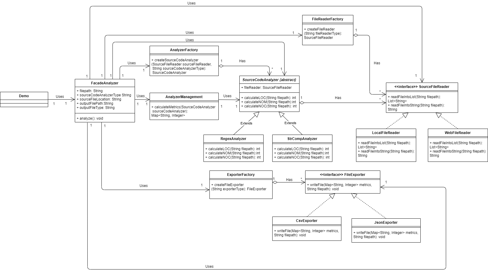

# Source Code Analyzer 

A JAVA application that reads a Java source code file that is stored locally or on the web, 
calculates the LOC, NOM and NOC metrics and finally, exports these metrics to an output file.

## Contents:

1. [Installing](#installing)
2. [Class Diagram](#class-diagram)
3. [SOLID Principles](solid-principles)
4. [Design Patterns used in this module](#design-patterns-used-in-this-module)
5. [Design patterns not used in this module and why](#design-patterns-not-used-in-this-module-and-why)

## Installing

A step by step series of examples that tell you how to get a development env running

Build Maven Project by running:

```
mvn install
```

Change to child directory of your preference

```
cd SourceCodeAnalyzer/
```

Change to target directory by

```
cd target/
```

Locate the .jar file by running

```
ls
```

Run the executable by executing
```
java –jar  SourceCodeAnalyzer-0.0.1-SNAPSHOT-jar-with-dependencies.jar arg0 arg1 arg2 arg3 arg4
```
were args translate to: 	
+ arg0 = “JavaSourceCodeInputFile” (e.g., src/test/resources/TestClass.java)
+ arg1 = “sourceCodeAnalyzerType” [regex|strcomp]
+ arg2 = “SourceCodeLocationType” [local|web]
+ arg3 = “OutputFilePath” (e.g., ../output_metrics_file)
+ arg4 = “OutputFileType” [csv|json]

Below there is an example:
```
java –jar SourceCodeAnalyzer-0.0.1-SNAPSHOT-jar-with-dependencies.jar ./src/test/resources/TestClass.java regex local metrics_results csv
```
## Class Diagram
This is the Class Diagram of this module.



## SOLID Principles

Some SOLID principles followed are these:

+ The Open-Closed Principle: FileExporter is expandible but closed for modification in the interface and implementations.
+ Interface segregation principle: FileExporter is a client-specific interface. The same is true for SourceFileReader and SourceCodeAnalyzer.
+ Low-coupling: the code interacts solely with the resultant interface, so that it will work with any classes which implement that interface.
+ The Liskov Substitution Principle: with the abstraction and interfaces used in this module we can use a different implementation without
altering the correctness of that program.
+ The Single Responsibility Principle: Each of the classes described except for the FacadeAnalyzer and DemoClient have only one reason to change.
It is either to be extended with a new subclass or a new method.

## Design Patterns used in this module

### Facade Pattern
The FacadeAnalyzer class serves as a front-facing interface masking more complex underlying or
structural code of codeanalyzer subpackages. All classes in the subpackages of codeanalyzer package are inside in the library.
This pattern was chosen to best suit the requirements and create an independent library.

#### Benefits

1. According to the requirements, the plan is to use the system as an independent library and thus hide any
implementation details from the DemoClient. This requirement is fully covered with the created FacadeAnalyzer class.

2. Since the codeAnalyzer package is a complex system with many different objects such as FileExporters, SourceFileReaders and SourceCodeAnalyzers, the 
FacadeAnalyzer class provides a simple interface to this complex system.

3. Since the FacadeAnalyzer class separates the DemoClient from implementation details, the applied Facade pattern de-couples the subsystem for clients and other
subsystems, thereby promoting subsystem independence and portability.

4. codeanalyzer package which is a system can now be used as an independent library which can be used by a project as the main system or as a subsystem
and communicate easily with other packages through the FacadeAnalyzer class.

#### Tradeoffs

This implementation of the facade pattern doesn't force us to unwanted tradeoffs, because it only adds additional layers of abstraction.
Sometimes the pattern can be overused in simple scenarios, which will lead to redundant implementations but this is not the case in this situation 
since it was explicitly specified in the requirements of the system.

### Strategy Pattern with Factory

The classes which participate in the strategy pattern are these:
+ FileExporter: Interface
+ CsvExporter: implements FileExporter
+ JsonExporter: implements FileExporter
+ ExporterFactory: Factory
+ FacadeAnalyzer: client

The main reason why we chose this pattern is to support more than one functionalities, in this case FileExporters for expandability.
More details are included in the benefits of this pattern in this situation. Also, strategy pattern is part of bridge pattern but we will discuss this
on the Bridge pattern section.

#### Benefits

1. According to the requirements there is the plan to introduce new types of FileExporters. This is effectively possible with this implementation
of the Strategy pattern.

2. The changes in other directions are minimized since if we add a new type of FileExporter to access it we can only
change the ExporterFactory. This means that FileExporter is  extendible with less need for changes in the FacadeAnalyzer.

3. FileExporters are now interchangeable. We can alter the instance of the FileExporter implementations to access the same
methods with a different instance.

4. Separation of concerns - the logic to instantiate classes is separated in the ExporterFactory class.

5. The ExporterFactory class adds flexibility to extend FileParser hierarchy without affecting Facade Analyzer.

#### Tradeoffs

1. FacadeAnalyzer is coupled to ExporterFactory. This means that if FileExporter is extended we need to change the Factory as well. Even though the Factory
is needed, sometimes it may be a liability.
2. The number of objects in the module is increased.

### Bridge Pattern
The classes which participate in the bridge pattern are these:

+ SourceCodeAnalyzer: Abstraction
+ RegexAnalyzer: Refined abstraction
+ StrCompAnalyzer: Refined abstraction
+ SourceFileReader: Implementor
+ LocalFileReader: Concrete implementor
+ WebFileReader: Concrete implementor
+ AnalyzerFactory: Factory since Bridge includes a strategy pattern.
+ AnalyzerManagement: Bridges the communication between FacadeAnalyzer and SourceCodeAnalyzer

We chose this pattern because we wanted to ensure the expandibility of the SourceCodeAnalyzers and SourceFileReaders. Also, we saw that there was a connection
between the SourceCodeAnalyzers and SourceFileReaders since the SourceFileReaders are called through the methods of the SourceCodeAnalyzers hence, the SourceCodeAnalyzers
are dependent of the SourceFileReaders, since without them they would not be able to achieve their core finctionality.

#### Benefits

1. The requirements specify that there is a plan to introduce new types of SourceCodeAnalyzers and SourceFileReaders are fully achieved.
2. The dimensions (Types of SourceCodeAnalyzers and Types of SourceFileReaders) can vary independently. They can be independently expanded for example.
3. Adding new Types of SourceFileReaders does not affect the SourceCodeAnalyzer hierarchy.
4. We hide implementation details from the FacadeAnalyzer class. For example, if we want to change something in the calculate metrics method, add for example new metrics,
the FacadeAnalyzer does not need to change at all. This results in low coupling for the FacadeAnalyzer class.
5. Extensibility. We can extend easily the SourceCodeAnalyzer and SourceFileReader classes.

#### Tradeoffs

1. Increased complexity due to over use of HAS-A principle. Since the HAS-A principle is used a lot in the Factory classes and also in the Bridge pattern
there is a possiblity that if the systhem is extended further there will be an overuse of the HAS-A principle.
2. Multiple Indirection: Since Bridge Pattern relies on HAS-A i.e. composition, it could chain multiple method calls to perform an operation leading to multiple stack operations and slight latency.
3. The number of objects in the module is increased.

## Design patterns not used in this module and why

### Null Object 

The Null Object was not used in this module because the tradeoffs outweighted the benefits. 
1. Instead of throwing errors in the Factory class we would have to do it in the Null Object class and this would result in code repitition
since each method would have to throw an Exception. Instead, we chose to avoid that and throw an Exception in the Factory class.
2. Testing Efficience. It is more efficient and thus limit errors to test the Exception from the Factory class.
